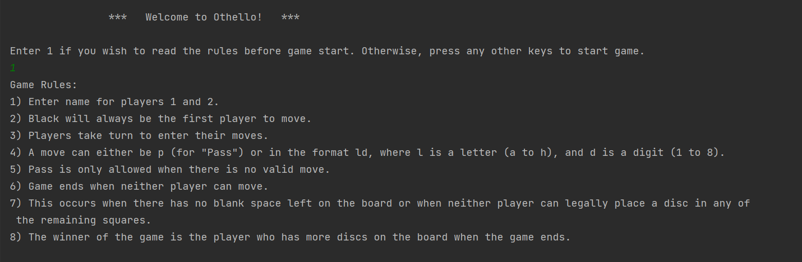
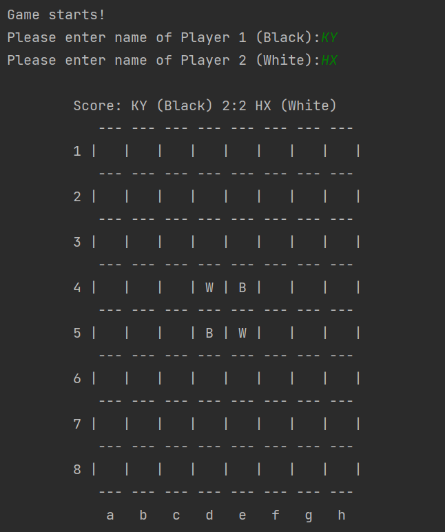
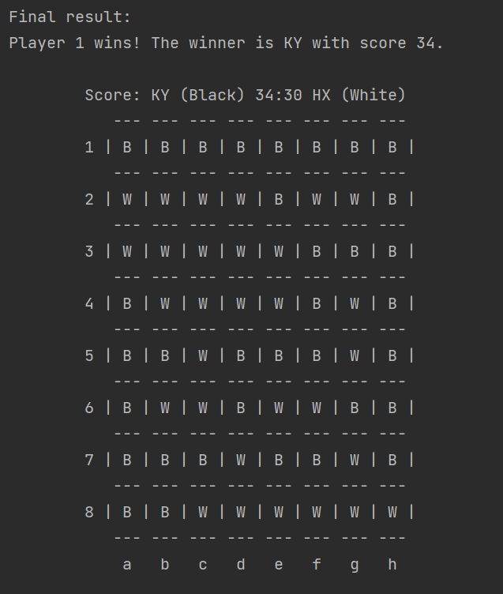
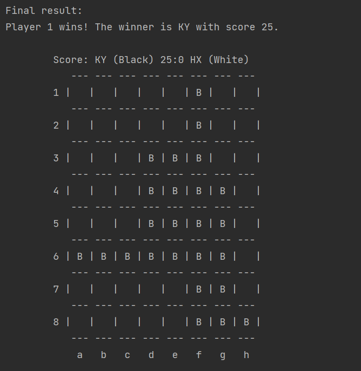

# Othello

Othello is a board game that is played on a board with 64 squares in an 8x8 arrangement using 64 black and white discs, black on one side, 
white on the other. Players are assigned black or white and take turns to place a disc with their assigned colour facing up. 
After each play, any discs with the opponent's colour displayed that are in a straight line bounded by the disc just placed and another
disc displaying the current player's colour are turned over to display the current player's colour. The winner of the game is the player 
who has the majority of discs turned to display their colour when the last move is made.

## 1 &nbsp;Game Start
### 1.1 &nbsp;Initialization of game
* Game rules can be shown before starting a game.
&nbsp;

* Both players are asked to input their name.
* The initial board is displayed with two black discs and two white discs on it.
&nbsp;

&nbsp;

&nbsp;

### 1.2 &nbsp;Take turn of game
* Player with black disc will has the first move.
&nbsp;

's move")
* Players take alternative turn until the game ends.
&nbsp;

's move")
* Players have to enter their move in the specific format 'ld' where l is a letter in range **a** to **h** and d is a digit in range **1** to **8**. 
* Players are allowed to pass only when there is no valid move.
* Place the disc on board and display the updated score and board 
&nbsp;

&nbsp;

## 2 &nbsp;Game End
### 2.1 &nbsp;End of game
* The game ends when:
&nbsp;

 &nbsp; &nbsp; &nbsp; &nbsp; a) There is no space left on board (all 64 discs have been placed) 
&nbsp;

&nbsp;

 &nbsp; &nbsp; &nbsp; &nbsp; b) Neither player can legally place a disc in any of the remaining squares.
&nbsp;

* The name and score of the winner will be displayed along with the final board.
* The final result will be save in a text file named 'othello-results.txt' before the program exits.
* The text file can be found in current directory.
* Example of text file:
&nbsp;

a) 
